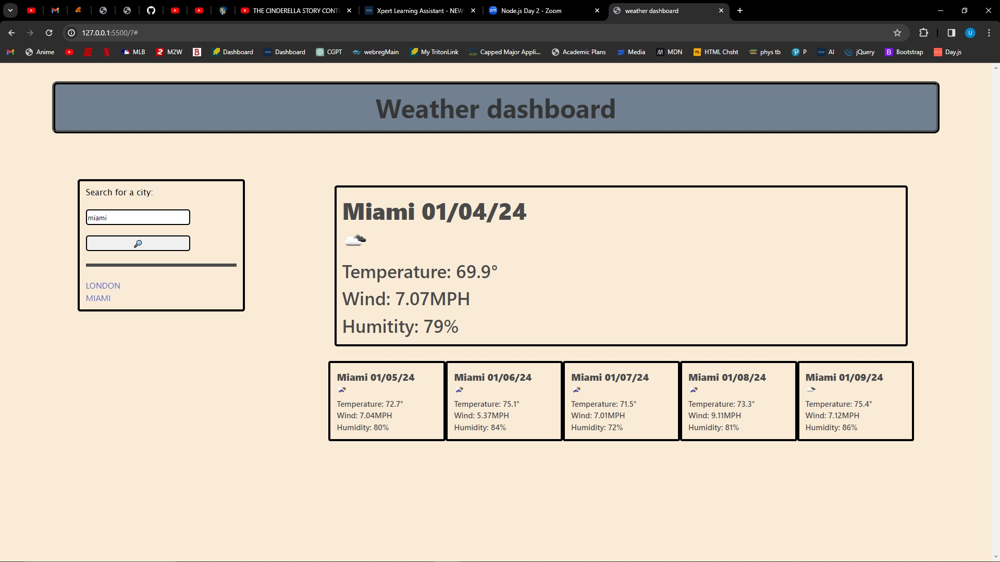

# Weather-Forecast

## User Story
As a user, I want to look up a city and retrieve its weather for today and the next five days. If I click on the previous links, then that city's weather will be displayed.

## Acceptance Criteria
GIVEN a weather dashboard with form inputs
WHEN I search for a city
THEN I am presented with current and future conditions for that city and that city is added to the search history
WHEN I view current weather conditions for that city
THEN I am presented with the city name, the date, an icon representation of weather conditions, the temperature, the humidity, and the the wind speed
WHEN I view future weather conditions for that city
THEN I am presented with a 5-day forecast that displays the date, an icon representation of weather conditions, the temperature, the wind speed, and the humidity
WHEN I click on a city in the search history
THEN I am again presented with current and future conditions for that city

## Webpage URL
https://ulisesd15.github.io/weather-forecast/

## Webpage Screenshot

## How to access files
JavaScript- weather-forecast/assets/script.js
CSS - weather-forecast/assets/css.style
html - weather-forecast/index.html